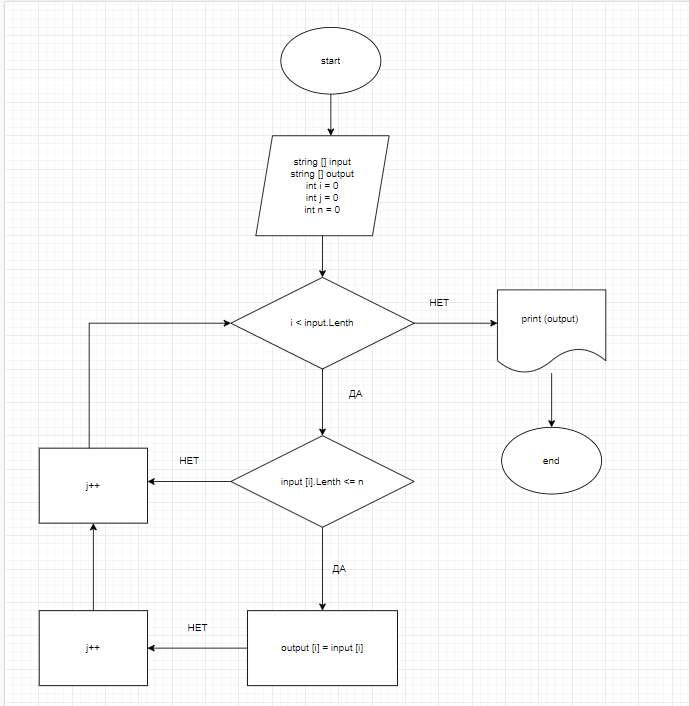

Задача:

Написать программу, которая из имеющегося массива строк формирует массив из строк, длина которых меньше либо равна 3 символа. Первоначальный массив можно ввести с клавиатуры, либо задать на старте выполнения алгоритма. При решении не рекомендуется пользоваться коллекциями, лучше обойтись исключительно массивами.

Алгоритм решения:

1.	Перебираем значения имеющегося массива
2.	Проверяем каждое значение массива, соответствует ли оно условию, когда длина строки меньше или равна трем
3.	Если строка соответствует  условию, переносим значение в новый массив
4.	Повторяем действия, описанные в п.1 и п.1  пока не достигнем конца имеющегося массива
5.	Выводим новый заполненный массив как результат

Блок схема алгоритма

